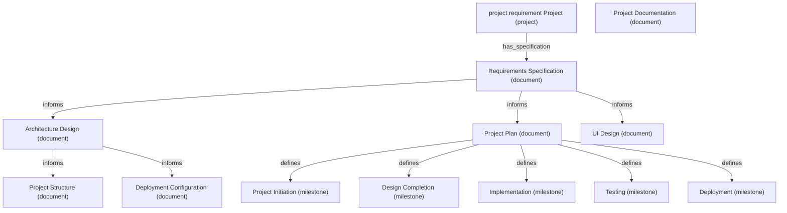

# project requirement Project - Project Summary

## Project Description
project requirement

## Project Status
Status: completed
Current Phase: deployment

## Documents

- Requirements Specification: docs/requirements_specification.md
- Architecture Design: design/architecture.md
- Project Structure: design/project_structure.md
- Project Plan: docs/project_plan.md
- UI Design: design/ui_design.md
- Project Documentation: docs/index.md
- Deployment Configuration: docs/deployment.md

## Components

## Implementations

## Test Suites

## Code Reviews

## Deployment Configurations

## Project Knowledge Graph

## Generated Files

- .gitignore
- README.md
- design/architecture.md
- design/components.md
- design/project_structure.md
- design/ui_design.md
- docs/api.md
- docs/deployment.md
- docs/developer_guide.md
- docs/index.md
- docs/installation.md
- docs/project_plan.md
- docs/requirements_specification.md
- docs/task_list.md
- docs/usage.md
- docs/user_guide.md
- requirements.txt
- setup.py
- src/__init__.py
- tests/__init__.py